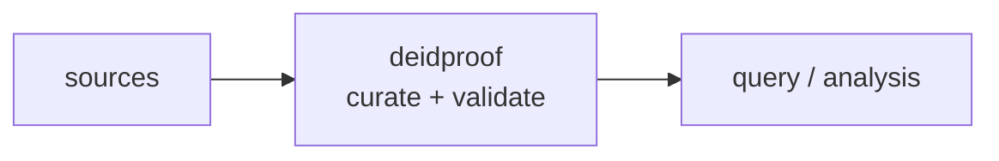

<a name="top"></a>

<div align="center">


# DEIDPROOF


### Re-identification risk assessment that computes k-anonymity, l-diversity, and HIPAA Safe Harbor compliance on a dataset.


[](https://pypi.org/project/cognis-deidproof/) [](https://github.com/cognis-digital/deidproof/actions) [](LICENSE) [](https://github.com/cognis-digital)


*Healthcare & Life-Sciences — HIPAA, PHI, FHIR/HL7, and clinical data.*


</div>


```bash

pip install cognis-deidproof

deidproof check export.csv --qi zip,age,sex --sensitive diagnosis -k 5 -l 2

```


## Usage — step by step

1. **Install** the CLI:
   ```bash
   pip install deidproof
   ```

2. **Check a CSV dataset** for re-identification risk, naming your quasi-identifier and sensitive columns:
   ```bash
   deidproof check dataset.csv --quasi-identifiers zip,age,sex --sensitive diagnosis
   ```

3. **Enforce thresholds** — require a minimum k-anonymity and l-diversity:
   ```bash
   deidproof check dataset.csv --quasi-identifiers zip,age,sex --sensitive diagnosis --min-k 5 --min-l 2
   ```

4. **Read the output.** Add `--format json` for machine-readable results:
   ```bash
   deidproof check dataset.csv --quasi-identifiers zip,age,sex --format json > risk.json
   ```

5. **Wire it into CI** — block a data release that fails k/l targets (non-zero exit):
   ```bash
   deidproof check dataset.csv --quasi-identifiers zip,age,sex --sensitive diagnosis --min-k 5 || exit 1
   ```

## Contents


- [Why deidproof?](#why) · [Features](#features) · [Quick start](#quick-start) · [Example](#example) · [Architecture](#architecture) · [AI stack](#ai-stack) · [How it compares](#how-it-compares) · [Integrations](#integrations) · [Install anywhere](#install-anywhere) · [Related](#related) · [Contributing](#contributing)


<a name="why"></a>

## Why deidproof?


Proves your 'de-identified' export actually is de-identified, emitting a signed risk report — the safety net researchers cite before publishing or sharing data.


`deidproof` is single-purpose, scriptable, and self-hostable: point it at a target, get prioritized results in the format your workflow already speaks (table · JSON · SARIF), gate CI on it, and let agents drive it over MCP.


<div align="right"><a href="#top">↑ back to top</a></div>


<a name="features"></a>

## Features


- ✅ K Anonymity

- ✅ L Diversity

- ✅ Safe Harbor Scan

- ✅ Analyze Rows

- ✅ Analyze Csv

- ✅ Runs on Linux/macOS/Windows · Docker · devcontainer

- ✅ Ports in Python, JavaScript, Go, and Rust (`ports/`)


<div align="right"><a href="#top">↑ back to top</a></div>


<a name="quick-start"></a>

## Quick start


```bash

pip install cognis-deidproof

deidproof --version

# k-anonymity + l-diversity + HIPAA Safe Harbor on a CSV export
deidproof check export.csv --qi zip,age,sex --sensitive diagnosis -k 5 -l 2

deidproof check export.csv --qi zip,age,sex --format json    # machine-readable

deidproof check export.csv --qi zip,age,sex --format sarif    # SARIF 2.1.0

deidproof check export.csv --qi zip,age,sex -k 5 || exit 1    # CI gate (exit 2 on fail)

```


<div align="right"><a href="#top">↑ back to top</a></div>


<a name="example"></a>

## Example


```text

$ deidproof check demos/01-basic/patients.csv --qi zip,age,sex --sensitive diagnosis -k 2 -l 2

DEIDPROOF 1.0.0 - de-identification report
========================================================
Rows analyzed        : 8
Quasi-identifiers    : zip, age, sex
Sensitive attributes : diagnosis

k-anonymity  : k = 1  [FAIL < 2]
l-diversity  : l = 1  [FAIL < 2]

Safe Harbor  : 5 finding(s)  [FAIL]
    S1 Name: column 'patient_name' - ...
    S6 Email address: column 'email' - ...
    S7 Social Security number: column 'ssn' - ...

OVERALL: FAIL          # exit code 2

```

### Demos — real-use scenarios

Each folder under [`demos/`](demos/) ships a realistic input file plus a
`SCENARIO.md` (where the data came from, the exact command, what to expect, how
to act):

| Demo | What it shows |
|---|---|
| [`01-basic`](demos/01-basic/) | Bad "de-identified" export — all three checks fail |
| [`02-clean`](demos/02-clean/) | Properly generalized export — `OVERALL: PASS` |
| [`03-mixed`](demos/03-mixed/) | **SARIF 2.1.0** export for code-scanning / CI |
| [`04-safe-harbor-leak`](demos/04-safe-harbor-leak/) | ED export leaking MRN, phone, email, dates |
| [`05-generalized-pass`](demos/05-generalized-pass/) | Registry release that passes `k=2`/`l=2` |
| [`06-l-diversity-gap`](demos/06-l-diversity-gap/) | k passes but l fails — the homogeneity attack |
| [`07-clinical-trial`](demos/07-clinical-trial/) | Small-N trial listing — unique on `(zip,age,sex)` |
| [`08-claims-export`](demos/08-claims-export/) | Payer claims with member/account IDs + ICD-10 |
| [`09-genomics-biobank`](demos/09-genomics-biobank/) | Biobank manifest leaking URL, IP, device serial |
| [`10-tsv-research-extract`](demos/10-tsv-research-extract/) | Tab-separated input via `--delimiter` |

### SARIF 2.1.0 output

`--format sarif` emits an OASIS **SARIF 2.1.0** log: a `deidproof` tool driver
with one reporting descriptor per HIPAA Safe Harbor category (`S1`–`S18`) plus
`DEID-K` / `DEID-L`, and one `error`-level result per finding (including failed
k-anonymity and l-diversity thresholds). Upload it with GitHub's `upload-sarif`
action to surface re-identification risk inline on pull requests.


<div align="right"><a href="#top">↑ back to top</a></div>


<a name="architecture"></a>

## Architecture





<div align="right"><a href="#top">↑ back to top</a></div>


<a name="ai-stack"></a>

## Use it from any AI stack


`deidproof` is interoperable with every popular way of using AI:


- **MCP server** — `deidproof mcp` (Claude Desktop, Cursor, Cognis.Studio, [uncensored-fleet](https://github.com/cognis-digital/uncensored-fleet))

- **OpenAI-compatible / JSON** — pipe `deidproof scan . --format json` into any agent or LLM

- **LangChain · CrewAI · AutoGen · LlamaIndex** — wrap the CLI/JSON as a tool in one line

- **CI / scripts** — exit codes + SARIF for non-AI pipelines


<div align="right"><a href="#top">↑ back to top</a></div>


<a name="how-it-compares"></a>

## How it compares


| | **Cognis deidproof** | ARX Data Anonymization Tool |

|---|:---:|:---:|

| Self-hostable, no account | ✅ | varies |

| Single command, zero config | ✅ | ⚠️ |

| JSON + SARIF for CI | ✅ | varies |

| MCP-native (AI agents) | ✅ | ❌ |

| Polyglot ports (JS/Go/Rust) | ✅ | ❌ |

| Open license | ✅ COCL | varies |


*Built in the spirit of **ARX Data Anonymization Tool**, re-framed the Cognis way. Missing a credit? Open a PR.*


<div align="right"><a href="#top">↑ back to top</a></div>


<a name="integrations"></a>

## Integrations


Pipes into your stack: **SARIF** for code-scanning, **JSON** for anything, an **MCP server** (`deidproof mcp`) for AI agents, and a webhook forwarder for SIEM/Slack/Jira. See [`docs/INTEGRATIONS.md`](docs/INTEGRATIONS.md).


<div align="right"><a href="#top">↑ back to top</a></div>


<a name="install-anywhere"></a>

## Install — every way, every platform


```bash

pip install "git+https://github.com/cognis-digital/deidproof.git"    # pip (works today)

pipx install "git+https://github.com/cognis-digital/deidproof.git"   # isolated CLI

uv tool install "git+https://github.com/cognis-digital/deidproof.git" # uv

pip install cognis-deidproof                                          # PyPI (when published)

docker run --rm ghcr.io/cognis-digital/deidproof:latest --help        # Docker

brew install cognis-digital/tap/deidproof                             # Homebrew tap

curl -fsSL https://raw.githubusercontent.com/cognis-digital/deidproof/main/install.sh | sh

```


| Linux | macOS | Windows | Docker | Cloud |

|---|---|---|---|---|

| `scripts/setup-linux.sh` | `scripts/setup-macos.sh` | `scripts/setup-windows.ps1` | `docker run ghcr.io/cognis-digital/deidproof` | [DEPLOY.md](docs/DEPLOY.md) (AWS/Azure/GCP/k8s) |


<div align="right"><a href="#top">↑ back to top</a></div>


<a name="related"></a>

## Related Cognis tools


- [`phiscrub`](https://github.com/cognis-digital/phiscrub) — Stream-scan logs, CSVs, and free-text notes for PHI (names, MRNs, SSNs, dates, addresses) and redact or tokenize in place.

- [`dicomsweep`](https://github.com/cognis-digital/dicomsweep) — De-identify DICOM imaging studies per the DICOM PS3.15 Annex E profile, scrubbing tags and burned-in pixel text.

- [`fhirlint`](https://github.com/cognis-digital/fhirlint) — Validate FHIR R4/R5 resources and bundles against profiles (US Core, etc.) with precise, line-level error reporting.

- [`hl7tap`](https://github.com/cognis-digital/hl7tap) — Parse, pretty-print, diff, and replay HL7 v2 messages over MLLP from the terminal.

- [`consentledger`](https://github.com/cognis-digital/consentledger) — Maintain a tamper-evident, hash-chained audit log of patient-data access and consent events.

- [`synthcohort`](https://github.com/cognis-digital/synthcohort) — Generate statistically realistic synthetic patient cohorts (FHIR/CSV) from a schema spec for dev and testing.


**Explore the suite →** [🗂️ all 170+ tools](https://github.com/cognis-digital/cognis-neural-suite) · [⭐ awesome-cognis](https://github.com/cognis-digital/awesome-cognis) · [🔗 cognis-sources](https://github.com/cognis-digital/cognis-sources) · [🤖 uncensored-fleet](https://github.com/cognis-digital/uncensored-fleet) · [🧠 engram](https://github.com/cognis-digital/engram)


<div align="right"><a href="#top">↑ back to top</a></div>


<a name="contributing"></a>

## Contributing


PRs, new rules, and demo scenarios are welcome under the collaboration-pull model — see [CONTRIBUTING.md](CONTRIBUTING.md) and [SECURITY.md](SECURITY.md).


> ### ⭐ If `deidproof` saved you time, **star it** — it genuinely helps others find it.


## Interoperability

`{}` composes with the 300+ tool Cognis suite — JSON in/out and a shared
OpenAI-compatible `/v1` backbone. See **[INTEROP.md](INTEROP.md)** for the
suite map, composition patterns, and reference stacks.

## License


Source-available under the **Cognis Open Collaboration License (COCL) v1.0** — free for personal, internal-evaluation, research, and educational use; **commercial / production use requires a license** (licensing@cognis.digital). See [LICENSE](LICENSE).


---


<div align="center"><sub><b><a href="https://cognis.digital">Cognis Digital</a></b> · one of 170+ tools in the <a href="https://github.com/cognis-digital/cognis-neural-suite">Cognis Neural Suite</a> · <i>Making Tomorrow Better Today</i></sub></div>

