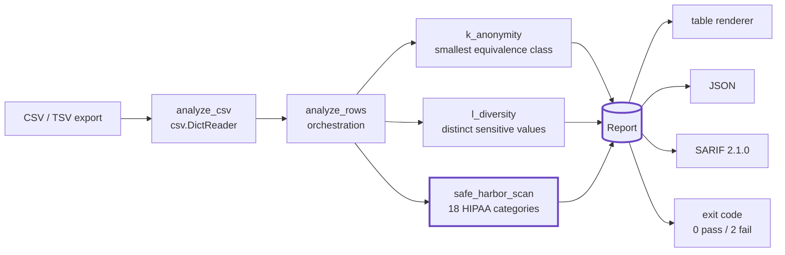
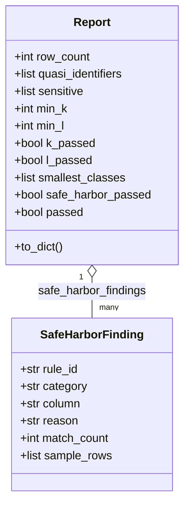

# DEIDPROOF — Architecture

`deidproof` proves whether a tabular healthcare export is actually
de-identified. It parses a CSV/TSV, computes three independent re-identification
metrics over it, and renders the verdict as a human table, machine JSON, or
OASIS SARIF 2.1.0 — all with the Python standard library only, fully offline.

## Pipeline

## Components

### CLI (`deidproof/cli.py`)
`deidproof check <csv> --qi … --sensitive … -k N -l N [--format table|json|sarif]`.
Splits the column lists, calls `analyze_csv`, renders the chosen format, and
returns the CI gate exit code: `0` when the dataset passes every requested
check, `2` when any privacy check fails, `1` on usage/IO error.

### Core engine (`deidproof/core.py`)
Standard-library only. The public API the demos and tests call directly:

- **`k_anonymity(rows, quasi_identifiers)`** → `(min_class_size, classes)`.
  Groups rows into equivalence classes keyed by the quasi-identifier tuple; the
  metric is the size of the *smallest* class. A dataset is k-anonymous for `k`
  iff `min_class_size >= k`.
- **`l_diversity(rows, quasi_identifiers, sensitive)`** → `(min_distinct, per_class)`.
  Distinct l-diversity: each class must hold at least `l` distinct values of the
  sensitive attribute. Defends against the homogeneity attack that k alone misses.
- **`safe_harbor_scan(rows, columns)`** → `[SafeHarborFinding]`. Detects the 18
  HIPAA Safe Harbor identifier categories (45 CFR 164.514(b)(2)) by **column-name
  keyword** *and* **cell-value regex** (SSN, email, URL, IPv4, phone, dates,
  age > 89).
- **`analyze_rows(...)` / `analyze_csv(...)`** orchestrate all three into a single
  `Report` and compute the overall pass/fail.

### Report (`deidproof/core.Report`)
The one dataclass everything flows through: row count, the requested
thresholds, `min_k` / `min_l` and their pass flags, the smallest equivalence
classes (for actionable output), the Safe Harbor findings, and the overall
`passed`. `to_dict()` is the JSON shape; `report_to_sarif()` maps it to SARIF.

### SARIF exporter (`deidproof/sarif.py`)
Serializes a `Report` to OASIS **SARIF 2.1.0**: a `deidproof` tool driver with
one reporting descriptor per Safe Harbor category (`S1`–`S18`) plus `DEID-K` /
`DEID-L`, and one `error`-level result per finding (including failed k/l
thresholds). Upload with GitHub's `upload-sarif` action to surface
re-identification risk inline on pull requests.

### MCP server (`deidproof/mcp_server.py`) and connect (`deidproof/connect.py`)
`deidproof mcp` exposes the check to AI agents over MCP; `connect.py` emits the
Cognis-suite interop envelope so findings compose with the wider toolchain.

## Why these choices

- **Standard library, no heavy deps.** The engine is pure `csv` + `re` +
  `collections`; it runs anywhere Python 3.10+ runs, with nothing to install.
- **Offline by construction.** Patient data never leaves the machine — there is
  no network path in the analysis.
- **One `Report`, many renderers.** Table for humans, JSON for pipelines, SARIF
  for code scanning — the same verdict, the same exit code.

See [DEMOS.md](DEMOS.md) for runnable, audience-specific walkthroughs.
